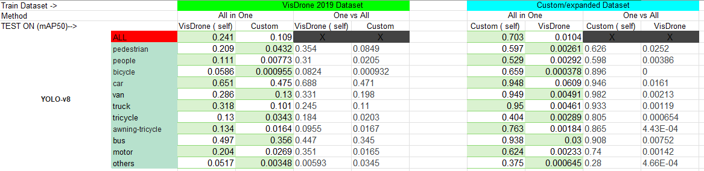
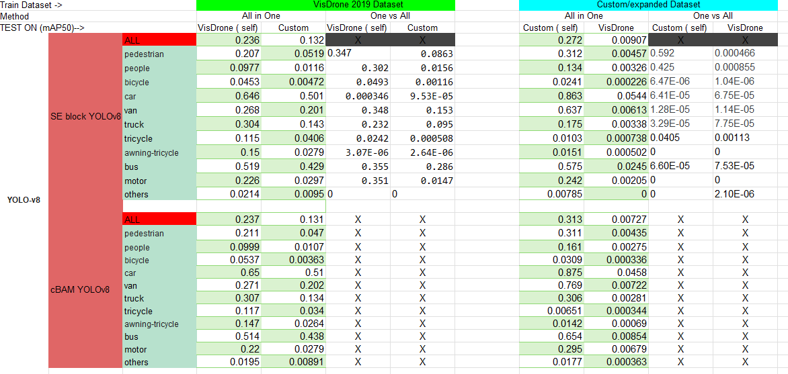

# YOLOv8 and Attention YOLOv8 (SE, SE + ResNet and CBAM + ResNet)


## Architecture 
We modified attention part 'A' with SE/CBAM etc in-between head and neck (in codes,combined as head)
<p align="center">
  
</p>

* Attention module namely SE,CBAM structure - 
<p align="center">
  
</p>


## Performance (working.....to add all parameters)
<p align="center">
  
</p>
<p align="center">
  
</p>


## Environment
```
  pip install -r requirements.txt
```

## Dataset
### Download the dataset
* You can download the Expanded Dataset on this [Link](https://www.kaggle.com/datasets/mohitsharmab21ee037/extended-dataset).
  
### Annotate in Yolo-Format
* Given annotation have 8 field [bbox_left, bbox_top, bbox_width, bbox_height, score, object_category, truncation, occlusion]
* format of yolo annotation is as - object-class,x_center,y_center,width,height (all normalized as)
* Use the create_dataset function with parameter train/test/val:
  ```
    create_dataset(annotations_path,images_path,output_dataset_path,'temp')
  ```
### Directory Structure
* The dataset must contain training and validation (optional-testing).

       Parsed Data(normalized labels with same name .jpg image name_xx.txt, name_xx.jpg)
          └── data   
               ├── meta.yaml
               ├── images
               │    ├── train
               │    │    ├── train_img1.png
               │    │    └── ...
               │    ├── valid
               │    │    └── ...
               │    └── test
               │         └── ...
               └── labels
                    ├── train
                    │    ├── train_annotation1.txt
                    │    └── ...
                    ├── valid
                    │    └── ...
                    └── test
                         └── ...

                      
### Data Augmentation
* working ( as require for our small dataset (custom/expanded)
  
## Methodology
* We have modified the model architecture of YOLOv8 by adding three types of attention modules, including <b>SE-Module (SE), ResNet with SE (SENet) and ResBlock Convolutional Block Attention Module (ResCBAM)</b>.
* Attention module namely SE,CBAM structure - 
<p align="center">
  
</p>

## Train & Validate
* We have provided a function to train, val, test( for both same and other dataset).
* Avoid traing with function for first time ( initialization)
* train_on_dataset-name(model, no of epoch)
```
  train_on_extended(model,15)
  train_on_visdrone(model,25)
```

* Arguments

You can set the value in the `./ultralytics/cfg/default.yaml`.


## Reference
<details><summary> <b>Expand</b> </summary>

* [https://github.com/RuiyangJu/Fracture_Detection_Improved_YOLOv8](https://github.com/RuiyangJu/Fracture_Detection_Improved_YOLOv8)

</details>
