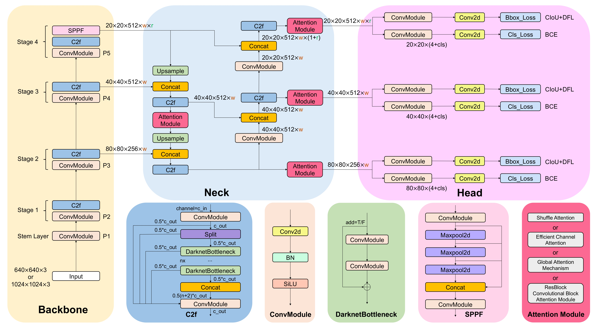

# YOLOv8 and Attention YOLOv8 (SE + ResNet and CMAM + ResNet)


## Architecture
<p align="center">
  
</p>

## Performance (working.....to add all parameters)
| Model | Test Size | Param. | FLOPs | AP<sub>50</sub><sup>same</sup> | AP<sub>50-95</sub><sup>same</sup> | Speed | AP<sub>50</sub><sup>other</sup> | AP<sub>50-95</sub><sup>other</sup> |
| :--: | :-: | :-: | :-: | :-: | :-: | :-: | :-: | :-: |
| YOLOv8+Ai1 | - | -.61M | -.9G |  -.58% | -.40% | -7.7ms | 0.62 | ---|
| YOLOv8+1vA | - | -.64M | -.4G |  -.25% | -.64% | -8.0ms | 0.62 | ---|
| YOLOv8+SE+Ai1 | - | -.64M | -.5G |  --24% | -.94% | -.7ms | 0.62 | ---|
| YOLOv8+SE+1vA | - | -.29M | -.5G | -.26% | -.00% | -.7ms | 0.62 | ---|
| YOLOv8+ResSE+Ai1 | - | -.64M | -.5G | -.24% | -.94% | -.7ms | 0.62 | ---|
| YOLOv8+ResSE+1vA | - | -.29M | -.5G | -.26% | -.00% | -.7ms | 0.62 | ---|
| YOLOv8+ResCBAM+Ai1 | - | -.29M | -.5G | -.98% | -.75% | -.1ms | 0.62 | ---|
| YOLOv8+ResCBAM+1vA | - | -.87M | -.2G | -.78% | -.16% | -.7ms | 0.62 | ---|


## Environment
```
  pip install -r requirements.txt
```

## Dataset
### Download the dataset
* You can download the Expanded Dataset on this [Link](https://www.kaggle.com/datasets/mohitsharmab21ee037/extended-dataset).
  
### Annotate in Yolo-Format
* Given annotation have 8 field [bbox_left, bbox_top, bbox_width, bbox_height, score, object_category, truncation, occlusion]
* format of yolo annotation is as - object-class,x_center,y_center,width,height (all normalized as)
* Use the create_dataset function with parameter train/test/val:
  ```
    create_dataset(annotations_path,images_path,output_dataset_path,'temp')
  ```
### Directory Structure
* The dataset must contain training and validation (optional-testing).


       Trainable Dataset
          └── data   
               ├── meta.yaml
               ├── images
               │    ├── train
               │    │    ├── train_img1.png
               │    │    └── ...
               │    ├── valid
               │    │    ├── valid_img1.png
               │    │    └── ...
               │    └── test
               │         ├── test_img1.png
               │         └── ...
               └── labels
                    ├── train
                    │    ├── train_annotation1.txt
                    │    └── ...
                    ├── valid
                    │    ├── valid_annotation1.txt
                    │    └── ...
                    └── test
                         ├── test_annotation1.txt
                         └── ...


                      
### Data Augmentation
* working ( as require for our small dataset (custom/expanded)
  
## Methodology
* We have modified the model architecture of YOLOv8 by adding three types of attention modules, including <b>SE-Module (SE), ResNet with SE (SENet) and ResBlock Convolutional Block Attention Module (ResCBAM)</b>.
<p align="center">
  
</p>

## Train & Validate
* We have provided a function to train, val, test( for both same and other dataset).
* Avoid traing with function for first time ( initialization)
* train_on_dataset-name(model, no of epoch)
```
  train_on_extended(model,15)
  train_on_visdrone(model,25)
```

* Arguments

You can set the value in the `./ultralytics/cfg/default.yaml`.


## Related Works

<details><summary> <b>Expand</b> </summary>

* [https://github.com/RuiyangJu/Bone_Fracture_Detection_YOLOv8](https://github.com/RuiyangJu/Bone_Fracture_Detection_YOLOv8)
* [https://github.com/RuiyangJu/YOLOv9-Fracture-Detection](https://github.com/RuiyangJu/YOLOv9-Fracture-Detection)
* [https://github.com/RuiyangJu/YOLOv8_Global_Context_Fracture_Detection](https://github.com/RuiyangJu/YOLOv8_Global_Context_Fracture_Detection)

</details>
